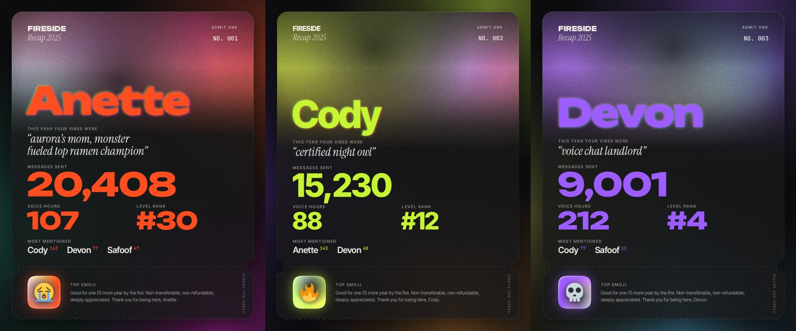

# Fireside Recap Studio

A live template for Fireside's end-of-year Discord recap cards, like Spotify Wrapped for the server.
Fill in each member's stats, pick their accent colour, drop in their photo, and download a
1080 × 1350 card. You can also export the whole server as a `.zip` in one go.



The design is a glass admission ticket. It has one accent colour per member, the member's photo faded
and grain-textured into the top, a heavy display name with a subtle chromatic aura, big stat
numbers, and a hypercolor glass tile in the stub for their top emoji.

## Running it

There's no build step and no backend. It's a static site.

- **Hosted:** enable GitHub Pages for this repo (Settings → Pages → *Deploy from a branch* →
  `main` / root). The studio will be live at `https://<user>.github.io/firesiderecap/`.
- **Locally:** serve the folder with any static server, then open the printed URL:

  ```sh
  npx serve .            # or: python3 -m http.server
  ```

  Opening `index.html` straight from disk won't work, because browsers block fonts and JS modules
  from `file://` pages.

Everything you enter autosaves in your browser. Nothing is uploaded anywhere.

## Yearly workflow

1. **Fields tab:** set up this year's stats. Rename, reorder, add or remove fields.
2. **Spreadsheet:** download a CSV with a column per field. Fill it in from Statbot and your XP bot
   (Google Sheets, Excel and Numbers all work).
3. **Import CSV:** every row becomes a card. Rows match existing cards by name, so you can
   re-import after fixing a number.
4. **Photos:** click through each member and drag their avatar onto the preview. Drag the photo on
   the card to reposition it, and scroll to zoom. **Match photo** picks an accent from their avatar.
5. **Export all:** a `.zip` with every card, named `fireside-recap-2026-07-anette.png`.
6. **Save:** download a project file (includes photos) as a backup. Next year, open it and use
   *Style → Start a new year* to clear the stats but keep names, photos, fields and styling.

## Fields

Fields are shared by every card. **A blank value hides that field on that one card**, so not
everyone needs every stat.

| Type | Looks like | Input |
| --- | --- | --- |
| **Stat** | Big number in the accent colour. Consecutive stats sit side by side (up to 3 per row). Tick **Own row** to give one a row to itself. Every number on a card is the same size. | `20408` shows as `20,408`. Short text like `#30` or `211 days` works too. |
| **Quote** | Italic serif line, with smart quotes added automatically. | `aurora's mom, monster fueled top ramen champion` |
| **Ranked list** | Names with small accent-coloured counts. | `Cody (143), Devon (77), Safoof (47)`, comma or line separated |
| **Emoji** | The first emoji field goes on the glass tile in the ticket stub. | Paste an emoji (rendered with Twemoji, same as Discord) or **Upload** a custom server emoji. |

The card lays itself out from top to bottom in field order, and scales everything down when a card
has lots of stats. Long names wrap onto two lines.

## CSV format

The first row is headers. `name` is required. `accent` (a hex colour like `#ff4d1f`) and
`avatar_url` are optional. Every other column is matched to a field by its label (case
insensitive). A column with no matching field creates a new Stat field.

```csv
name,accent,avatar_url,This year your vibes were,Messages sent,Voice hours,Level rank,Most mentioned,Top emoji
Anette,#ff4d1f,,"aurora's mom, monster fueled top ramen champion",20408,107,#30,"Cody (143), Devon (77)",😭
Cody,,,certified night owl,15230,88,#12,"Anette (143)",🔥
```

For photos, uploading or dragging files in is the most reliable. Loading from a URL only works when
the image host allows it.

## Style options

Style tab: the event title, year, an optional top-right tag, and the fine print (`{name}` is
replaced by the member's name). There's also a display font, name size (applies to every card), photo treatment (duotone, black & white, halftone, natural),
film grain, chromatic aura, background glow, glass see-through, base colours, and export size or
format.

Grain makes PNGs heavy: about 3 MB at 1080 px and about 12 MB at 2160 px. Pick JPEG for the large
size if you're posting to Discord without Nitro (10 MB limit).

## Project layout

```
index.html          editor shell
styles/app.css      editor UI
styles/fonts.css    self-hosted @font-face rules
src/render.js       the card: canvas layout + drawing (preview = export)
src/main.js         editor: state, inspector, CSV, export, drag-to-frame
src/state.js        data model, defaults, palettes, font presets
src/assets.js       image + Twemoji loading
src/color.js        colour utilities + accent extraction
src/csv.js, src/zip.js, src/storage.js
assets/fonts/       woff2 files (Latin + Latin Extended)
```

The card is drawn on a `<canvas>` at its exact export size, so the preview is exactly what you
download, in every browser.

## Credits

- Fonts: [Unbounded](https://fonts.google.com/specimen/Unbounded), [Archivo Black](https://fonts.google.com/specimen/Archivo+Black),
  [Inter Tight](https://fonts.google.com/specimen/Inter+Tight), [Bricolage Grotesque](https://fonts.google.com/specimen/Bricolage+Grotesque),
  [Syne](https://fonts.google.com/specimen/Syne), [Instrument Serif](https://fonts.google.com/specimen/Instrument+Serif) and
  [JetBrains Mono](https://www.jetbrains.com/lp/mono/), all under the SIL Open Font License, via [Fontsource](https://fontsource.org).
- Emoji: [Twemoji](https://github.com/jdecked/twemoji) (CC-BY 4.0), loaded from jsDelivr.
